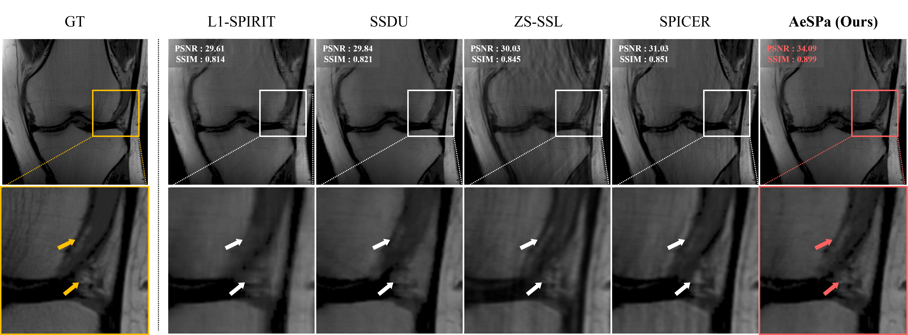
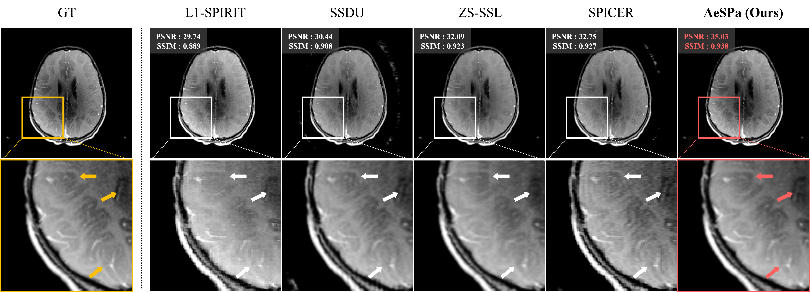

# AeSPa : Attention-guided Self-supervised Parallel imaging for MRI Reconstruction


### Repository for [AeSPa : Attention-guided Self-supervised Parallel imaging for MRI Reconstruction](d) accepted in [CVPR 2025](https://cvpr.thecvf.com/) 
 #### Jinho Joo<sup>1</sup>\*, Hyeseong Kim<sup>1,2</sup>\*, Hyeyeon Won<sup>1</sup>, Deukhee Lee<sup>2</sup>, Taejoon Eo<sup>1</sup>\*\*, Dosik Hwang<sup>1,2</sup>\*\*  
 #### <sup>1</sup>Yonsei University, <sup>2</sup>Korea Institute of Science and Technology
 #### \* denotes equal contribution, \** denotes corresponding authors  

<p align="center"></p>
<p align="center"></p>

## Our Goal
We propose a novel zero-shot scan-specific self-supervised reconstruction method for magnetic resonance imaging to reduce scan times.
We use only undersampled k-space for training and evaluation.

## AeSPa Architecture
<p align="center"></p>


## Patch Note
<span style="font-size: 12px;"> [25.06.10] : We release our code!</span>


## Citation
```
@inproceedings{joo2025aespa,
  title={AeSPa : Attention-guided Self-supervised Parallel imaging for MRI Reconstruction},
  author={Joo, Jinho and Kim, Hyeseong and Won, Hyeyeon and Lee, Deukhee and Eo, Taejoon and Hwang, Dosik},
  booktitle={Proceedings of the Computer Vision and Pattern Recognition Conference},
  pages={5217--5226},
  year={2025}
}
```

## Google scholar
[Jinho Joo](https://scholar.google.com/citations?user=PlmGOWIAAAAJ&hl=ko)

[Hyeseong Kim](https://scholar.google.com/citations?user=Vooc3lUAAAAJ&hl=ko)
## Q&A
If you have a question regarding the code, please email at jinho381 AT yonsei DOT ac DOT kr and hyeseongkim At yonsei DOT ac DOT kr.
